<p align="left"> 

<h1 align="center">Hi 👋, I'm Angel Saikia</h1>
<h3 align="center">A motivated Java Developer from India.</h3>

- 🔭 I’m currently working on **Spring Boot CRUD App !**

- 👨‍💻 All of my projects are available at [**Portfolio**](https://dhunu.github.io/)

- 💬 Ask me about **Java, SQL, Hibernate, Spring Framework, HTML, CSS, Javascript**

- 📫 How to reach me **angelsaikia333@gmail.com**

- 📄 Know about my experiences [**Resume**](http://bit.ly/3I3Nuw1)

<h2 align="center">Connect with me:</h2>
<p align="center">
  <a href="https://www.linkedin.com/in/angel-saikia/" target="_blank">
    
  </a>
  <a href="https://discord.gg/4Y7tszW" target="_blank">
    
  </a>
  <a href="https://www.instagram.com/saikiaangel_/" target="_blank">
    
  </a>
  <a href="https://twitter.com/AngelSaikia1" target="_blank">
    
  </a>
</p>

<h2 align="center">My Tech Stacks: </h2>
<p align="center">
  <a href="https://skillicons.dev">
    
  </a>
</p>

<h2 align="center">Tools and Software: </h2>
<p align="center">
  <a href="https://skillicons.dev">
    
  </a>
</p>


<!-- <div style="display="flex"; flex-direction="row";">
  
  

  
  
</div> -->

<h2 align="center">Wakatime Stats:</h2>

<!--START_SECTION:waka-->


📊 **This Week I Spent My Time On** 

```text
🕑︎ Time Zone: Asia/Kolkata

💬 Programming Languages: 
Other                    8 hrs               ████████████████████░░░░░   78.96 % 
TypeScript               1 hr 26 mins        ████░░░░░░░░░░░░░░░░░░░░░   14.22 % 
TSConfig                 13 mins             █░░░░░░░░░░░░░░░░░░░░░░░░   02.20 % 
JSON                     7 mins              ░░░░░░░░░░░░░░░░░░░░░░░░░   01.16 % 
Ezhil                    6 mins              ░░░░░░░░░░░░░░░░░░░░░░░░░   01.03 % 
```


<!--END_SECTION:waka-->

<h2 align="center" >Github Stats: </h2>

<div align="center" style="display=flex; flex-direction=row">

<!--   [](https://github.com/anuraghazra/github-readme-stats) -->
  
  
  
  
  
  
  
  <p align="center"> <a href="https://github.com/ryo-ma/github-profile-trophy"></a> </p>
  
<!--    -->

</div>

[](https://github.com/ashutosh00710/github-readme-activity-graph)

<p align="center">
<h2> ✍️ Random Dev Quote </h2>
<!--  -->


</p>


